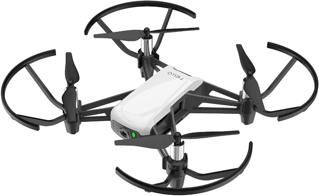
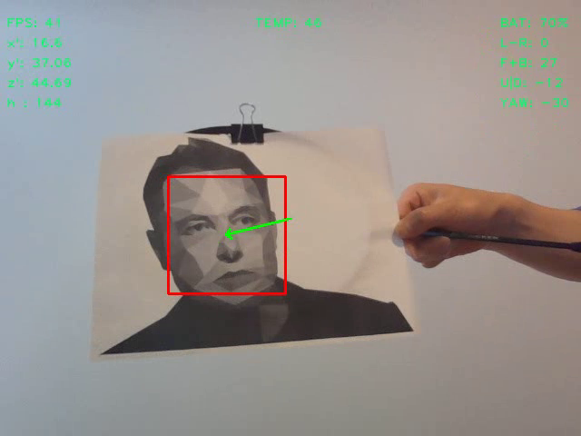

# Face Track Tello

A face tracking Tello drone



## Hardware

* [TELLO](https://www.ryzerobotics.com/tello)

## Software

* [Python 3](https://www.python.org/)
* [Open CV](https://opencv.org/)

## Install package

```bash
python3 -m venv venv
. venv/bin/activate
pip3 install --upgrade pip wheel setuptools
pip3 install --upgrade -e .
```

## Install requirements

```bash
pip install -r requirements.txt
```

## Usage

```bash
python3 -m face_track
face_track
python3 src/face_track/__main__.py
```

## Uninstall package

```bash
pip uninstall face_track
```

## Simulation

This script has a simulation module [mockdjitellopy.py](./src/face_track/mockdjitellopy.py). It enables development, tuning, and testing without physical tello drone. When the script is launched in development environment, it displays and records video. Below is a screenshot of the video.


* FPS: frames per second
* x': x-axis acceleration
* y': y-axis acceleration
* z': z-axis acceleration
* h : tof height (cm)
* TEMP: temperature (Celsius)
* BAT: battery percentage [0, 100]
* L-R: left right velocity [-100, 100]
* F+B: forward backward velocity [-100, 100]
* U|D: up down velocity [-100, 100]
* YAW: yaw velocity [-100, 100]

## Issues

* when face_track generates the following error:

```bash
Illegal instruction (core dumped)
```
  
add "export OPENBLAS_CORETYPE=ARMV8" to the bottom of the .bashrc file

```bash
echo "export OPENBLAS_CORETYPE=ARMV8" >> ~/.bashrc
```

## PID controller

A proportional–integral–derivative controller (PID controller or three-term controller) is a control loop mechanism employing feedback that is widely used in industrial control systems and a variety of other applications requiring continuously modulated control. A PID controller continuously calculates an error value e(t) as the difference between a desired setpoint (SP) and a measured process variable (PV) and applies a correction based on proportional, integral, and derivative terms (denoted P, I, and D respectively), hence the name.

By WIKIPEDIA - <https://en.wikipedia.org/wiki/PID_controller>


By Arturo Urquizo - <http://commons.wikimedia.org/wiki/File:PID.svg>, CC BY-SA 3.0, <https://commons.wikimedia.org/w/index.php?curid=17633925>

The PID control value is calculated in the following function in [pid.py](./src/face_track/pid.py).

```python
def update(self, pv: float) -> float:
    """ calculate the control value
    :param pv: the process variable, the error = SP - PV (SP is the setpoint, and PV(t) is the process variable)
    :return: the control variable
    """
    # grab the current time and calculate delta time
    self.currTime = time.time()
    deltaTime = min(self.currTime - self.prevTime, PID.LOST_TIME)

    # if deltaTime < PID.EPSILON:
    #     return self.cV
    error = self.SP - pv
    # calculate the delta error
    deltaError = error - self.prevError

    # calculate the proportional term
    self.cP = error

    # calculate the integral term
    self.cI += error * deltaTime

    # calculate the derivative term (and prevent divide by zero)
    self.cD = (deltaError / deltaTime) if deltaTime > 0.0 else 0.0

    # save previous time and error for the next update
    self.prevTime = self.currTime
    self.prevError = error

    # sum the terms and return
    self.cV = sum(
        [self.kP * self.cP, self.kI * self.cI, self.kD * self.cD])
    PID.LOGGER.debug(
        f"{self.name} {self.cP} {self.cI} {self.cD} {self.cV}")

    return self.cV
```

The actual proportional, integral, and derivative terms (denoted P, I, and D respectively) are tuned and defined in [tracker.py](./src/face_track/tracker.py)

```python
    # terms for forward and backward speed control
    self.fb_pid = PID('fb',
                      kP=0.5,
                      kI=0.01,
                      kD=0.1,
                      SP=math.sqrt(w * h / 12))
    # terms for up and down speed control
    self.ud_pid = PID('ud', kP=0.5, kI=0.01, kD=0.1, SP=h / 2)
    # terms for left and right speed control
    self.lr_pid = PID('lr', kP=-0.5, kI=-0.01, kD=-0.1, SP=w / 2)
    # terms for yaw speed control
    self.yaw_pid = PID('yaw', kP=-0.5, kI=-0.01, kD=-0.1, SP=w / 2)
```

## Face Recognition

The face recognition is performed by Haar classifier, which is the pre-trained face detection classifiers in OpenCV. This blog [Face Detection with Python using OpenCV](https://www.datacamp.com/community/tutorials/face-detection-python-opencv) provides more information on Haar classifier. Haar classifier, compared to other methods, SSD, YOLO, etc, has the following advantages:

* Lightweight
* Fast (15 FPS on Jetson Nano)
* Small model size (900KB)
* Pre-trained

The actual face recognition code is defined in [tracker.py](./src/face_track/tracker.py)

```python
    self.face_cascade = cv2.CascadeClassifier("haarcascade_frontalface_default.xml")

    def findFace(self, img):
        """detect front faces in the image. If multiple faces are detected, it returs the face with largest area.
        :param img: the image array in BGR
        :return: the detected face center and its area
        """
        gray = cv2.cvtColor(img, cv2.COLOR_BGR2GRAY)
        faces = self.face_cascade.detectMultiScale(image=gray,
                                                   scaleFactor=1.3,
                                                   minNeighbors=5,
                                                   minSize=(20, 20),
                                                   maxSize=(200, 200))

        faceListCenter = []
        faceListArea = []

        for (x, y, w, h) in faces:
            cv2.rectangle(img, (x, y), (x + w, y + h), (0, 0, 255), 2)
            cx = x + w // 2
            cy = y + h // 2
            area = w * h

            faceListCenter.append([cx, cy])
            faceListArea.append(area)

        if len(faceListArea) != 0:
            i = faceListArea.index(max(faceListArea))
            # Draw line from image center to face center
            iy, ix, _ = img.shape
            #face_center = (faceListCenter[i][0], faceListCenter[i][1])
            cv2.arrowedLine(img, (ix // 2, iy // 2),
                            tuple(faceListCenter[i]),
                            color=(0, 255, 0),
                            thickness=2)
            return img, [faceListCenter[i], faceListArea[i]]
        else:
            return img, [[0, 0], 0]
```

## Notes

* use official TELLO app to update firmware
* use official TELLO app to calibrate
* fly tello in good light condition
* fly tello on flat floor with visual patterns
* face tello camera
* press any key to land tello
* tune PID parameters if tello oscillates

## Credits

This script has been adapted from following projects and tutorials.

* [I create AI tracking drone using DJI Tell](https://www.youtube.com/watch?v=rHY3T7-vK38)
* [I Forced a Drone Bot To Follow Me](https://www.youtube.com/watch?v=4KiH3Fq3olM)
* [Drone Face Tracking PID using OpenCV Pyhton](https://www.youtube.com/watch?v=P2wl3N2JW9c)
* [First DJI Tello drone face tracking test with openCV](https://www.youtube.com/watch?v=WFz5I1iRhLY)
* [Tello Drone Sandbox](https://github.com/youngsoul/tello-sandbox)
* [How to Tune a PID Controller](https://www.youtube.com/watch?v=IB1Ir4oCP5k)
* [Empirical PID gain tuning (Kevin Lynch)](https://www.youtube.com/watch?v=uXnDwojRb1g)
* [Elon Musk face png](https://images.app.goo.gl/iwe2d6kBiLybTh6z8)
