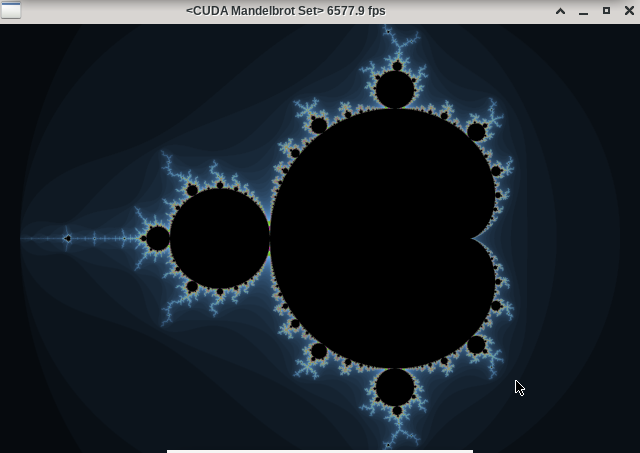
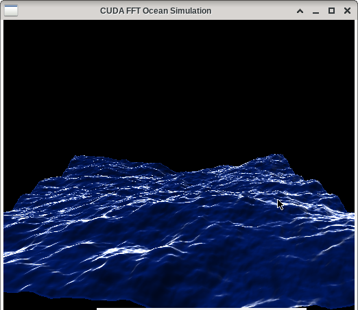
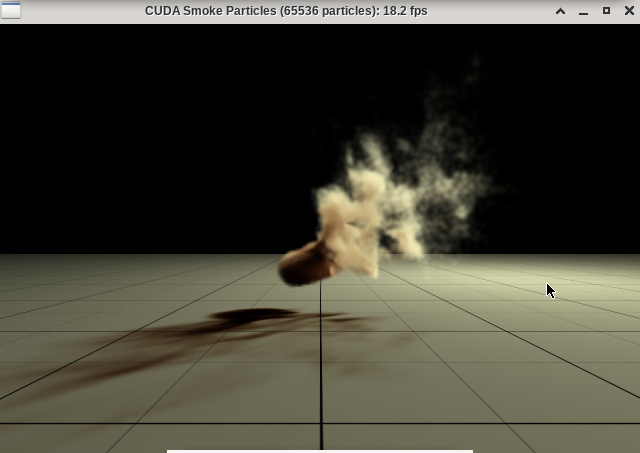

# Alpha Drone

A face tracking drone using OpenCV face recognition and PID control on Wind River Linux.
The actual drone used in this project is TELLO, however the face recognition and PID control is generic.
The ground station used in this project is Jetson Nano running Wind River Linux LTS 19.

## Hardware

* [TELLO](https://www.ryzerobotics.com/tello)
* [NVIDIA Jetson Nano Developer Kit B01](https://www.nvidia.com/en-us/autonomous-machines/embedded-systems/jetson-nano/)

## Software

* [Wind River Linux LTS 19](https://www.windriver.com/products/linux/)
* [NVIDIA JetPack SDK 4.3](https://developer.nvidia.com/embedded/jetpack)

## SD Card Image

* [Yocto Project](./wrl_19/README.md)

## CUDA samples

For details on install, build, and run, refer to this [README](./wrl_19/README.md)

* Mandelbrot Set

  

* Particles

  

* Ocean FFT

  
* N-Body

  
* Smoke Paticles

  
&nbsp;
&nbsp;

## Face Tracking

The Face Tracking package contains the tello control to track human face. After running, the Tello drone first hovers to 1.7 meters high, then starts to recognize and track the closest human face. PID control is applied to stablize the drone. Durin the flight, if any key is pressed, then program exits and the drone lands immediately. When face track python script is running, it automatically records video (640*480) to its working directory in the name vid-YYYYMMDD-hhmmss.avi.

Here is a sample screen shot

For details on install, and run, refer to this [README](./face_track/README.md)
